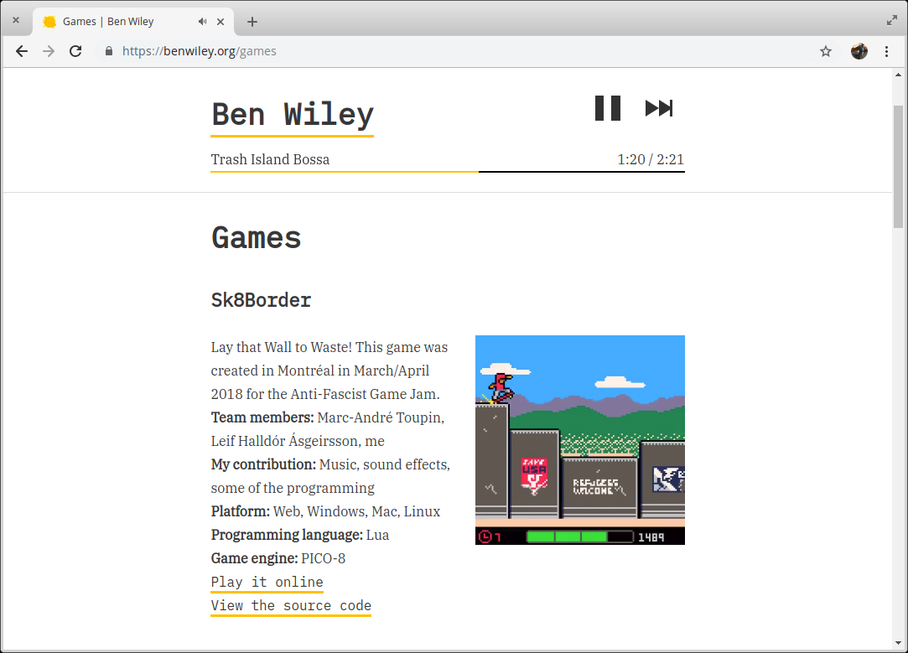

# Cassette


Cassette is a zero-config-required media player component library for React. The default responsive UI works great in desktop or mobile web browsers. The flexible core handles the logical complexities of common audio and video player paradigms, while allowing you to implement any UI you can come up with.

### This is Cassette v2, which is in beta.

See version 1 (also known as `react-responsive-audio-player`) [here](https://github.com/benwiley4000/cassette/blob/master/README.md)!

## Cassette is split into four packages

- [`@cassette/core`](/packages/core) provides React Context-based components which expose an API for consuming and updating media player state
- [`@cassette/components`](/packages/components) contains some convenient React component building blocks which can be used in media player user interfaces created with `@cassette/core`
- [`@cassette/player`](/packages/player) provides a responsive, zero-config-needed React media player component, implemented with `@cassette/core`
- [`@cassette/hooks`](/packages/hooks) provides optional [React Hooks](https://reactjs.org/docs/hooks-intro.html) for consuming media player state

### [See full documentation (with integrated live demos) here](https://benwiley4000.github.io/cassette/styleguide)

#### ⚠️ Note on installation

If you wanted to install, for instance, the `@cassette/core` and `@cassette/player` packages, you would run:

```console
npm install @cassette/core @cassette/player
```

**I do not control, nor do I have any contact with the owner of, the npm package called [`cassette`](https://www.npmjs.com/package/cassette) (without the `@`).** If you `npm install cassette`, you will be using the wrong library! However it turns out this package is used for managing playlist data. So if you really want to confuse the other devs on your team, you can try using `cassette` and `@cassette` together!

**If you're not using npm and you need production-ready scripts to include in your project, check out [the releases](https://github.com/benwiley4000/cassette/releases). You can also look on unpkg, e.g. [here](https://unpkg.com/@cassette/core@2.0.0-beta.0/dist/es5/).**

## 📼 Cassette in the wild 📼

What can you build with Cassette? Here are some examples:

### [rexmort.us](https://rexmort.us)
<a href="https://rexmort.us">
  
</a>

A site showcasing creative content, including several podcast series which can be listened to while navigating the rest of the site.

#### How is Cassette used?
The `MediaPlayerControls` UI from the `@cassette/player` package can be seen at the bottom of the page, featuring the included play/pause, mute toggle, and media progress controls (with some custom CSS styles applied). `PlayerContextProvider` wraps the whole page, and is used on each of the podcast pages where we can select a podcast to play, and see an indication of which podcast is playing currently.

### [OwlTail](https://owltail.com)
<a href="https://owltail.com">
  
</a>

A web app where users can explore curated popular podcasts and schedule queues of podcasts to listen to in the browser.

#### How is Cassette used?
Instead of using Cassette's default UI, OwlTail's player UI is all custom-built. It relies on a page-level `PlayerContextProvider` to provide media data and functionality. The control UI at the bottom of the screen features some controls which don't even exist in the default Cassette UI, like a playback rate control, and buttons for skipping back and forward by 30 second intervals; even though Cassette doesn't provide this UI, its callbacks make it simple to implement this sort of behavior. The progress bar, although featuring custom UI, relies on the `MediaProgressBar` helper from the `@cassette/components` package, which is designed to work well with both mouse and touch devices.

The UI in the rest of the app is synced with the player via the `PlayerContextProvider` wrapper, so that the currently-playing podcast will always display as such when encountered in the queue or a podcast listing.

### [benwiley.org](https://benwiley.org)
<a href="https://benwiley.org">
  
</a>

A personal site featuring a portfolio of work, including some video game soundtrack pieces, which can be sampled while browsing the rest of the site's content.

#### How is Cassette used?
This site uses `@cassette/player`'s `PlayPauseButton` and `ForwardSkipButton` components, while wrapping the `MediaProgressBar` helper from `@cassette/components` for a custom progress navigation UI. Because the `PlayerContextProvider` wraps the whole page, we can integrate playback controls inline on the music portfolio page, dynamically displaying a media progress control below the description for the currently-selected track.

## Development

For building and testing instructions, see [CONTRIBUTING.md](CONTRIBUTING.md).

## Acknowledgements

Thanks to [BrowserStack](http://browserstack.com/) for providing their platform free of charge for this project (and many other open source projects). We're using BrowserStack to test compatibility across multiple browsers and platforms.

<a href="https://www.browserstack.com">
  
</a>

### Icons

The standard control components make use of icons from various sources.

The CSS YouTube-style play/pause button and the skip button were authored in part by [@benwiley4000](https://github.com/benwiley4000), with heavy assistance from [this CodePen](https://codepen.io/OxyDesign/pen/ojpepQ) by [@OxyDesign](https://github.com/OxyDesign).

The SVG repeat, shuffle, fullscreen and volume icons come from Google's [material-design-icons](https://github.com/google/material-design-icons).
