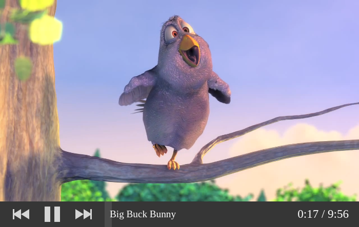

Want to get onramped with Cassette quickly, without reading a bunch of API documentation?

### I: Hello World

If you're using HTML with script tags, here's your minimum Hello World with Cassette:

```html
<!DOCTYPE html>

<!-- include @cassette/player's stylesheet -->
<link rel="stylesheet" href="https://unpkg.com/@cassette/player/dist/css/cassette-player.css">

<!-- app container -->
<div style="max-width:700px" id="app"></div>

<!-- dependencies -->
<script src="https://unpkg.com/react@16.8.6/umd/react.development.js"></script>
<script src="https://unpkg.com/react-dom@16.8.6/umd/react-dom.development.js"></script>
<script src="https://unpkg.com/prop-types@15.7.2/prop-types.js"></script>
<script src="https://unpkg.com/resize-observer-polyfill@1.5.1/dist/ResizeObserver.js"></script>

<!-- other @cassette packages which are dependencies -->
<script src="https://unpkg.com/@cassette/core@2.0.0-beta.1/dist/es5/cassette-core.js"></script>
<script src="https://unpkg.com/@cassette/components@2.0.0-beta.1/dist/es5/cassette-components.js"></script>

<!-- @cassette/player's javascript -->
<script src="https://unpkg.com/@cassette/player@2.0.0-beta.1/dist/es5/cassette-player.js"></script>

<script>
  // your code!

  var MediaPlayer = cassettePlayer.MediaPlayer;

  var playlist = [
    {
      url:
        'http://commondatastorage.googleapis.com/gtv-videos-bucket/sample/BigBuckBunny.mp4',
      title: 'Big Buck Bunny'
    },
    {
      url:
        'http://commondatastorage.googleapis.com/gtv-videos-bucket/sample/ElephantsDream.mp4',
      title: 'Elephants Dream'
    }
  ];

  ReactDOM.render(
    React.createElement(
      MediaPlayer,
      {
        playlist: playlist,
        showVideo: true
      }
    ),
    document.getElementById('app')
  );
</script>
```

<div class="screenshot_wrapper">
  
  <div class="notice"></div>
</div>

### II: Hello World with npm

If you're using npm or yarn and a bundler like Parcel or Webpack, you can do the same thing with this JavaScript (just install `@cassette/player` first):

```jsx static
import { MediaPlayer } from '@cassette/player';

import '@cassette/player/dist/css/cassette-player.css';

const playlist = [
  {
    url:
      'http://commondatastorage.googleapis.com/gtv-videos-bucket/sample/BigBuckBunny.mp4',
    title: 'Big Buck Bunny'
  },
  {
    url:
      'http://commondatastorage.googleapis.com/gtv-videos-bucket/sample/ElephantsDream.mp4',
    title: 'Elephants Dream'
  }
];

ReactDOM.render(
  <MediaPlayer playlist={playlist} showVideo />,
  document.getElementById('app')
);
```

### III: Controls configuration

Let's say you want to change the controls a bit. You don't need the back skip button, but you _would_ like to add a mute control. That's easy:

```jsx static
import { MediaPlayer } from '@cassette/player';

import '@cassette/player/dist/css/cassette-player.css';

const playlist = /* unchanged */;

ReactDOM.render(
  <MediaPlayer
    playlist={playlist}
    showVideo
    controls={[
      'spacer',
      'playpause',
      'forwardskip',
      'mute',
      'spacer',
      'progress'
    ]}
  />,
  document.getElementById('app')
);
```

<div class="screenshot_wrapper">
  
  <div class="notice"></div>
</div>

### IV: Bring your own controls

You also want to throw in a control to adjust the playback rate. But that's not included with Cassette! The good news is, it's pretty simple to implement a control like that yourself:

```jsx static
import { MediaPlayer } from '@cassette/player';

import '@cassette/player/dist/css/cassette-player.css';

const playlist = /* unchanged */;

function PlaybackRateControl({ playbackRate, onSetPlaybackRate }) {
  return (
    <div style={{ color: 'white', display: 'flex', alignItems: 'center' }}>
      Speed: x
      <input
        type="number"
        min={0.5}
        max={3}
        step={0.25}
        value={playbackRate}
        onChange={e => onSetPlaybackRate(Number(e.target.value))}
        style={{ width: 50 }}
      />
    </div>
  );
}

ReactDOM.render(
  <MediaPlayer
    playlist={playlist}
    showVideo
    controls={[
      'spacer',
      'playpause',
      'forwardskip',
      'mute',
      playerContext => (
        <PlaybackRateControl
          playbackRate={playerContext.playbackRate}
          onSetPlaybackRate={playerContext.onSetPlaybackRate}
        />
      ),
      'spacer',
      'progress'
    ]}
  />,
  document.getElementById('app')
);
```

<div class="screenshot_wrapper">
  
  <div class="notice"></div>
</div>

### V: Blowing off the lid

Now you want something crazy.. you want to display a menu to select and play a track from the playlist, and _outside_ of your `MediaPlayer`. How can we do this? The answer is, by dividing `MediaPlayer` up into its component parts - `MediaPlayerControls` and `PlayerContextProvider`.

Note that some `MediaPlayer` props belong to `PlayerContextProvider`, and some props belong to `MediaPlayerControls`:

```jsx static
import { MediaPlayerControls } from '@cassette/player';
import { PlayerContextProvider } from '@cassette/core';

import '@cassette/player/dist/css/cassette-player.css';

const playlist = /* unchanged */;

function PlaybackRateControl() {/* unchanged */}

ReactDOM.render(
  <PlayerContextProvider playlist={playlist}>
    <MediaPlayerControls
      showVideo
      controls={/* unchanged */}
    />
  </PlayerContextProvider>,
  document.getElementById('app')
);
```

At this point, your app should still look the same.

Lastly, you'll create your playlist menu component using a higher-order component called `playerContextFilter`. You can render it anywhere as a descendant of your `PlayerContextProvider`:

```jsx static
import { MediaPlayerControls } from '@cassette/player';
import { PlayerContextProvider, playerContextFilter } from '@cassette/core';

import '@cassette/player/dist/css/cassette-player.css';

const playlist = /* unchanged */;

function PlaybackRateControl() {/* unchanged */}

function PlaylistMenu({ playlist, activeTrackIndex, onSelectTrackIndex }) {
  return (
    <ol>
      {playlist.map((track, i) => {
        const playing = activeTrackIndex === i;
        return (
          <li key={track.title}>
            {playing && <strong>{track.title} (playing)</strong>}
            {!playing &&
              <button
                onClick={() => onSelectTrackIndex(i)}
              >
                {track.title}
              </button>}
          </li>
        );
      })}
    </ol>
  );
}

PlaylistMenu = playerContextFilter(PlaylistMenu, [
  'playlist',
  'activeTrackIndex',
  'onSelectTrackIndex'
]);

ReactDOM.render(
  <PlayerContextProvider {/* props unchanged */}>
    <MediaPlayerControls {/* props unchanged */} />
    <div>
      <h3>Select a track:</h3>
      <PlaylistMenu />
    </div>
  </PlayerContextProvider>,
  document.getElementById('app')
);
```

<div class="screenshot_wrapper">
  
  <div class="notice"></div>
</div>

That's a brief overview - hopefully it gets you off the ground running with Cassette!
